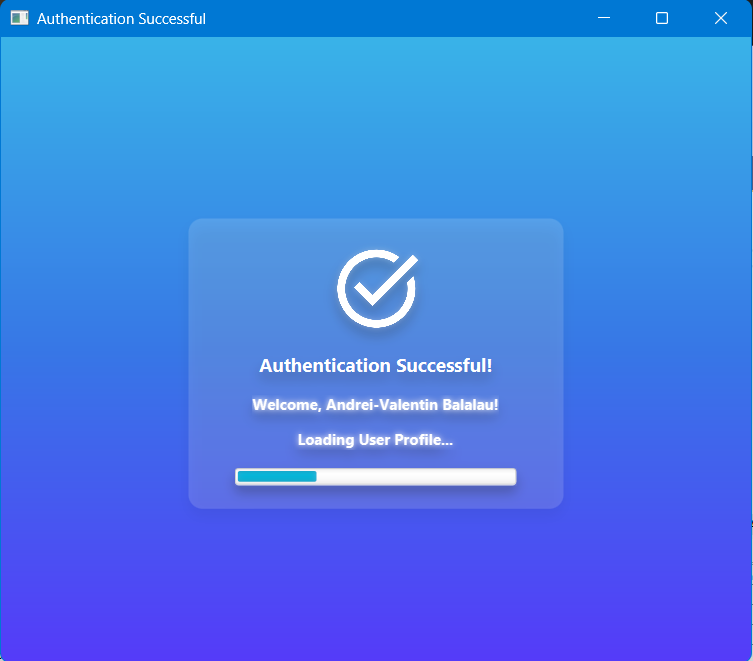
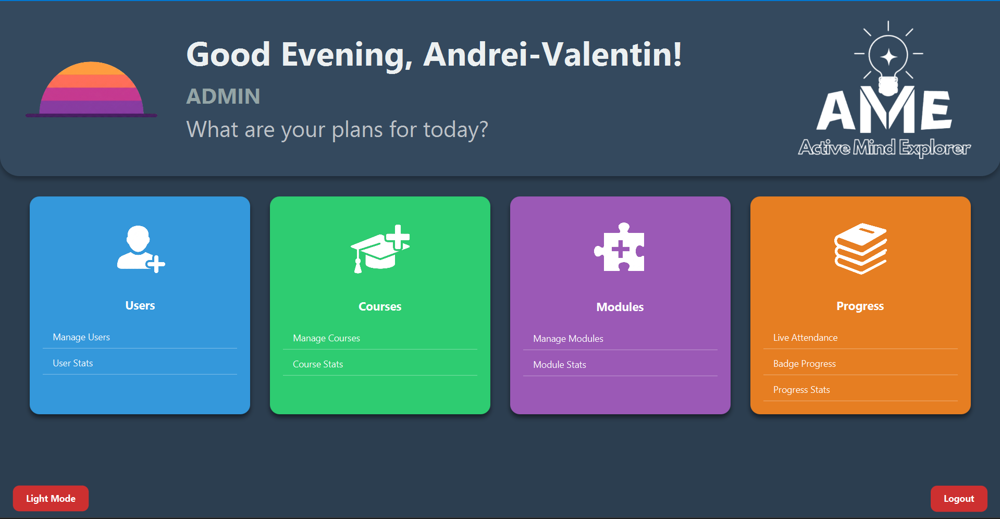
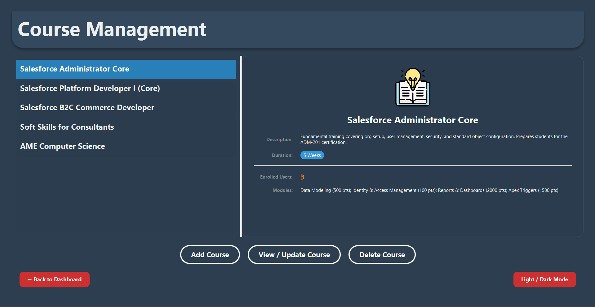
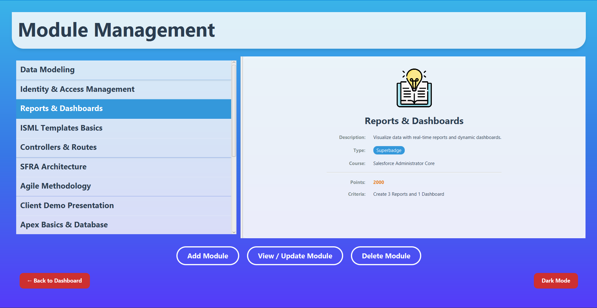
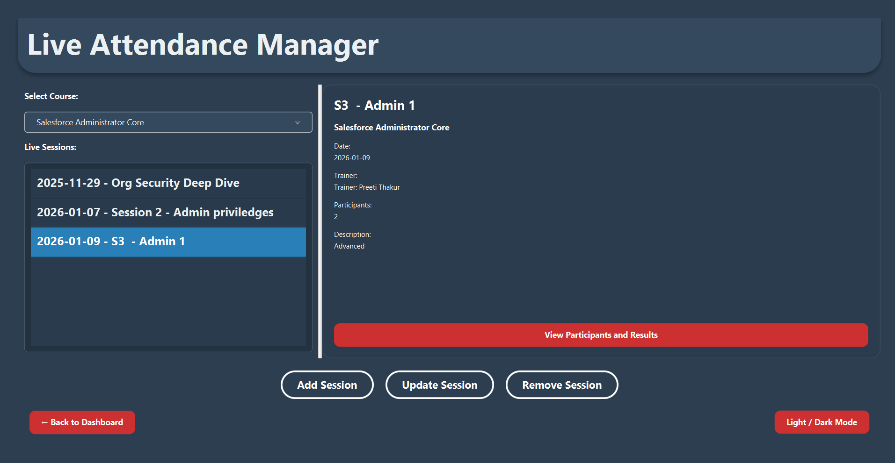
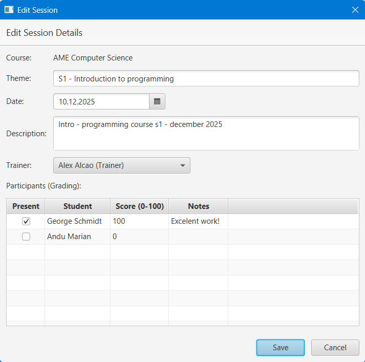
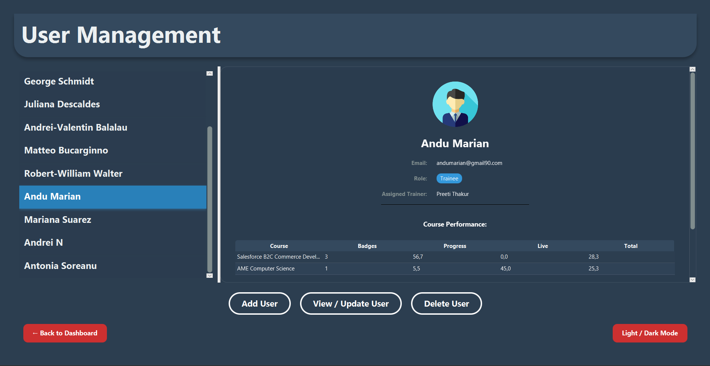
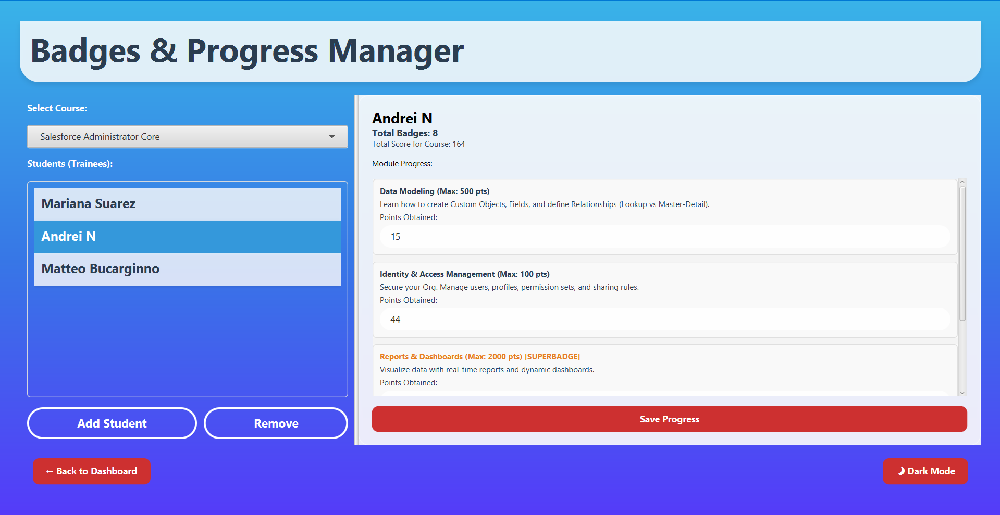

# Course management system 

A comprehensive client-server application designed for educational institutions, training centers and active learning environments - it allows administrators to manage courses, track live attendance, organize study modules and provides students with a dashboard to track their badges and progress.

##  Architecture

The application is built using a modern decoupled architecture:
- **Backend (Server):** Spring Boot REST API
- **Frontend (Client):** JavaFX Desktop Application
- **Database:** Microsoft SQL Server

##  Key features

- **User management & authentication:** Secure login for different roles (Admin, Trainer, Student).
- **Course & module management:** Create, edit and categorize courses. Add learning modules to specific courses.
- **Live attendance tracking system:** Interactive UI to track real-time student presence and grading during live sessions.
- **Badges & progress tracking:** Gamification system showing students their total score, earned badges and course progression.
- **Responsive & modern UI:** Features a sleek Dark Mode and fluid components built with JavaFX and CSS.
- **Advanced SQL interactions:** Employs complex native SQL queries for efficient data aggregation and statistical reporting.

##  Tech stack

### Server side
- Java 21+
- Spring Boot (Web, Data JPA)
- Hibernate
- Microsoft SQL server
- Maven

### Client side
- JavaFX (FXML, CSS)
- Jackson (for JSON parsing)
- `java.net.http.HttpClient` for REST Communication

---

##  How to run the project locally

### 1. Database setup
The application requires a Microsoft SQL Server instance.
1. Make sure SQL Server is installed and running on your machine!
2. Open SQL Server Management Studio (SSMS).
3. Right-click on the **Databases** node in Object Explorer and select **Restore Database...**
4. Choose **Device** and browse to the `AME.bak` file provided in this repository.
5. Click **OK** to restore the database with all its schema and data intact.
6. *(Optional)* If your database credentials (username/password) differ from the defaults, update them in the backend configuration file located at `server/src/main/resources/application.properties`.

### 2. Start the Backend server
1. Navigate to the `server/` directory:
   ```bash
   cd server
   ```
2. Run the Spring Boot application using Maven:
   ```bash
   mvn spring-boot:run
   ```
   You can also use this command when entering the `CourseManagement/server` folder:
   ```bash
   ..\mvnw.cmd spring-boot:run 
    ``` 
   *The server will start on `http://localhost:8080`.*
   *f you have an active or background process running on port 8080, consider killing the process and restarting the server.*

### 3. Start the JavaFX client
1. Open a new terminal and navigate to the root directory of the project.
2. Compile and run the JavaFX application:
   ```bash
   mvn clean javafx:run
   ```

   You can also use this command when entering the CourseManagement folder:
   ```bash
   .\mvnw clean javafx:run 
    ``` 
3. Use the credentials (email address and password) provided in the database setup (AME.bak backup database file) to log in (e.g., as admin or collaborator). You can *NOT* use the default credentials (admin/admin or student/student) to log in!
   
   **Warning** - Trainees and trainers can not access the app/ Dashboard! Depending on the roles in the database (Admin/Collaborator), you will be redirected to the appropriate dashboard. You can find more details in the "How to Use the Application" section.

---

##  How to use the application

Once both the server and client are running, follow this basic workflow to explore the application's features.

### 1. Finding login credentials
The application authenticates directly against the data stored in your SQL Server database. There are no hardcoded default accounts.

To log in:
1. Open SQL Server Management Studio (SSMS).
2. Run a query on your restored database: `SELECT Email, Password, Role FROM Users` or `SELECT * FROM Users` to obtain all the user information.
3. Use an existing **Email** and **Password** from that list to log into the JavaFX application. Make sure to choose an account with the role you wish to test (e.g., Administrator, Trainer or Collaborator).


### 2. Access levels | Workflows

**Note:** Only **Administrators** and **Collaborators** have access to the dashboard application. Trainees/Students and trainers do not have access to this management interface.

#### Administrator workflow
Administrators have full access to all features in the application:
1. **Login mechanism:** Access the dashboard using an Administrator account.
2. **Course & module management:** Create new courses, assign trainers and build `Self-Paced` or `Live` modules.
3. **Live attendance:** Start and manage Live Sessions, track real-time attendance and assign grades.
4. **Statistics:** View complex data aggregations regarding student performance and course popularity.

#### Collaborator workflow
Collaborators have restricted access, focused solely on managing live sessions:
1. **Login:** Access the dashboard using a Collaborator account.
2. **Live sessions:** View assigned live sessions, track attendance and add/manage session-specific data. They cannot create courses, modules, or access administrative statistics.
   
   **Warning** - You may encounter some optimisation issues regarding the Collaborator dashboard UI, in terms of object scaling. 
---

##  Project structure

```
CourseManagementApp/
├── server/             # Spring Boot backend source code
│   ├── src/main/java/  # Controllers, Services, Repositories, Models
│   └── src/main/resources/ # application.properties
├── src/main/               # JavaFX client source code
│   ├── java/               # UI Controllers, Client DAOs, Models
│   └── resources/          # FXML views, CSS styles (Dark/Light mode)
├── AME.bak                 # SQL database and records
├── pom.xml                 # Maven configuration for the Client
├── README.md               # Project documentation (for more information, please view the App presentation (EN/RO version) PDF files
└── [other files/ folders]
```

##  Screenshots

### Authentication


### Administrator Dashboards



### Course & Module Management



### Live Attendance



### Users & Progress



This project was created and developed for educational purposes. 

Andrei Valentin Bălălău - January 2026
